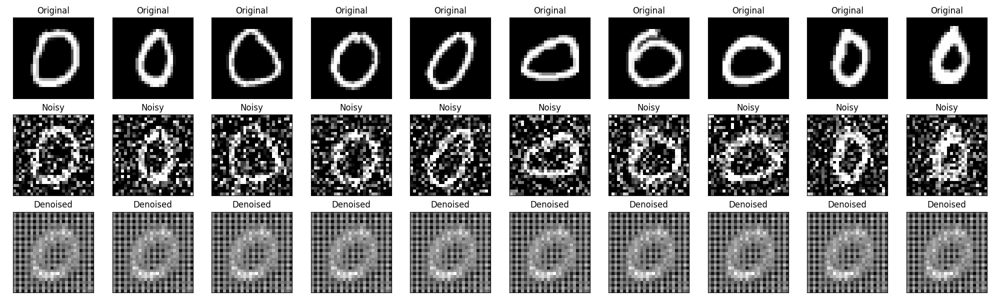

# MNIST Denoising Autoencoder

This project implements a Convolutional Denoising Autoencoder using PyTorch to remove noise from images in the MNIST dataset.

## Overview
An Autoencoder is a deep learning model that compresses input data into a latent representation (encoder) and reconstructs it back (decoder). In this project, we explicitly add Gaussian noise to the MNIST digits and train the model to reconstruct the original, clean digits, effectively teaching it how to denoise images.

## Project Structure
- `denoising_autoencoder.py`: The main PyTorch script that loads data, injects noise, defines the model architecture, trains the model, and evaluates it.
- `denoising_autoencoder.pth`: The saved weights of the trained autoencoder.
- `denoising_results.png`: A visual comparison showing Original, Noisy, and Denoised images.
- `requirements.txt`: Python dependencies.

## Installation
Ensure you have Python installed, then install the required libraries:
```bash
pip install -r requirements.txt
```

## Usage
Run the script to train the model from scratch:
```bash
python denoising_autoencoder.py
```
*(Note: You will need to extract the MNIST png dataset into `archive/mnist_png/` before running)*

## Results
The model achieves a very low Mean Squared Error (MSE) on the test dataset. Below is an example of the model successfully denoising heavily corrupted digits:


